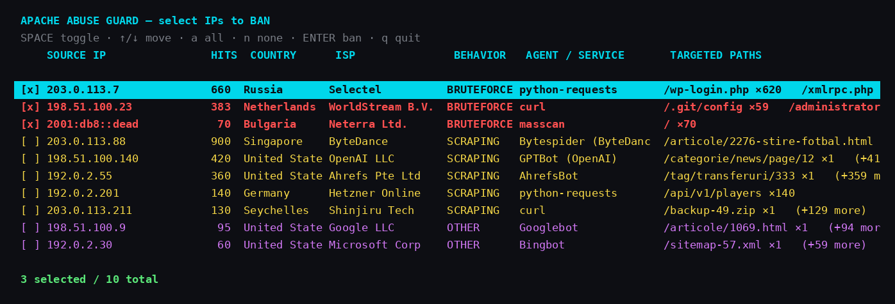
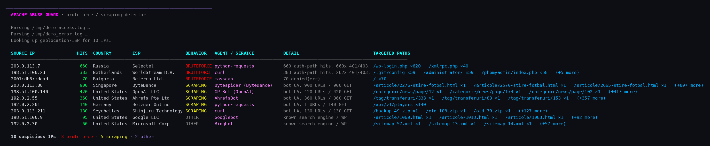

# Apache Abuse Guard

> Parse your Apache logs, find the brute-forcers and scrapers, and ban them from an interactive terminal — in one command.

`apache_abuse_guard.py` reads your Apache `access.log` + `error.log`, identifies the
IPs that are most likely **brute-forcing logins** or **scraping the site**, enriches
each one with **country / ISP** info, and presents a colored report. You then tick the
IPs you actually want to drop and it installs the `iptables` / `ip6tables` rules for you.

It's a **single file with zero third-party dependencies** — just Python 3 standard
library — so you can drop it on any server and run it.



The analysis report it builds before the selector:



> The IPs above are RFC-5737 documentation addresses used for the demo; real runs show your actual offenders.

---

## Features

- **Brute-force detection** — flags IPs hammering auth/exploit endpoints
  (`wp-login.php`, `xmlrpc.php`, `/.env`, `/.git`, phpMyAdmin, `eval-stdin.php`, …)
  or piling up `401`/`403`/`denied` responses.
- **Scraper detection** — catches automated user-agents (Bytespider, GPTBot, CCBot,
  AhrefsBot, SemrushBot, `python-requests`, `curl`, `masscan`, `nuclei`, …) and
  high-volume wide-surface crawling — while **whitelisting** real search engines
  (Googlebot, Bingbot, DuckDuckBot, …) so you don't ban them by accident.
- **GeoIP + ISP enrichment** via the free [ip-api.com](https://ip-api.com) batch API
  (no key required) so you can see *who* and *from where*.
- **Interactive TUI selector** (`curses`) — `SPACE` to toggle, `a`/`n` for all/none,
  `ENTER` to ban. Brute-force IPs are **pre-selected**; scrapers are left for you to
  decide (many are "legitimate-ish" AI/SEO bots).
- **Safe, reversible blocking** — rules go into a dedicated `APACHE_ABUSE` iptables
  chain so they're easy to review and undo, and existing firewall blocks
  (e.g. from fail2ban) are detected and hidden.
- **Report-only mode** — analyze without ever touching the firewall.
- **IPv4 + IPv6** aware throughout.

## Requirements

- Python **3.6+** (standard library only — no `pip install` needed)
- Apache combined-format logs
- `iptables` / `ip6tables` and **root** — only needed to *apply* bans; the report runs as any user
- Outbound HTTP to `ip-api.com` for geolocation (optional — use `--no-geo` to skip)

## Install

```bash
git clone https://github.com/crsftw/apache_abuse_guard.git
cd apache_abuse_guard
chmod +x apache_abuse_guard.py
```

## Usage

```bash
# Analyze the default logs and open the interactive banner (needs sudo to ban)
sudo ./apache_abuse_guard.py

# Point at custom log paths and raise the consideration threshold
sudo ./apache_abuse_guard.py \
     --access /var/log/apache2/access.log \
     --error  /var/log/apache2/error.log \
     --min-count 50

# Just look — never touch the firewall
./apache_abuse_guard.py --no-ban

# Skip the geo/ISP lookup (faster, offline-friendly)
./apache_abuse_guard.py --no-geo --no-ban
```

### Selector keys

| Key            | Action                 |
| -------------- | ---------------------- |
| `↑` / `↓`      | Move cursor            |
| `SPACE`        | Toggle the current IP  |
| `a` / `n`      | Select all / none      |
| `PgUp` / `PgDn`| Page through the list  |
| `ENTER`        | Ban the selected IPs   |
| `q` / `ESC`    | Quit without banning   |

### Options

| Flag          | Default                          | Description                                          |
| ------------- | -------------------------------- | ---------------------------------------------------- |
| `--access`    | `/var/log/apache2/access.log`    | Path to the Apache access log                        |
| `--error`     | `/var/log/apache2/error.log`     | Path to the Apache error log                         |
| `--min-count` | `50`                             | Minimum requests for an IP to be considered          |
| `--top`       | `200`                            | Cap the report to the N worst offenders              |
| `--no-geo`    | off                              | Skip the country/ISP lookup                          |
| `--no-rdns`   | off                              | Skip reverse-DNS verification of search-engine UAs   |
| `--no-ban`    | off                              | Report only — never modify the firewall              |

## How detection works

Each source IP is aggregated and classified:

- **`BRUTEFORCE`** (red, pre-selected) — `≥10` failed/POSTed auth-path hits, or
  `≥25` `401/403`, or `≥25` denied entries in the error log, or a sustained
  `POST` + auth-path pattern. Auth-path hits only count when the request was a
  `POST` or came back `401/403/404` — a user rendering `/login` is not an attack.
- **`SCANNING`** (orange) — `≥50` `404`s making up at least half of the IP's
  traffic: a vulnerability scanner walking a wordlist of paths that don't exist.
- **`SCRAPING`** (yellow) — a dominant bot user-agent with `≥50` hits, or very
  high-volume crawling across a wide URL surface — *unless* the UA is a recognized
  search engine. Search-engine UAs are only trusted after reverse-DNS →
  forward-DNS confirmation (Googlebot must really resolve to `*.googlebot.com`);
  spoofed ones are flagged as `fake search-engine UA`.
- **`OTHER`** (grey/purple) — verified search engines, or simply high-volume
  traffic worth a look.

## What it does to your firewall

Bans are added as `DROP` rules in a dedicated chain so nothing else is disturbed:

```bash
# Review what was added
iptables  -nL APACHE_ABUSE
ip6tables -nL APACHE_ABUSE

# Undo everything this tool created
iptables  -F APACHE_ABUSE
ip6tables -F APACHE_ABUSE
```

The chain is hooked into `INPUT` once (idempotently). IPs already blocked elsewhere
(manual rules, fail2ban) are detected and hidden from the report so you don't
double-ban them.

## Safety notes

- Banning requires **two** confirmations: opening the selector, then typing `yes`.
- Nothing is changed unless you're root **and** you confirm — run without `sudo`,
  or with `--no-ban`, for a read-only report.
- Review the proposed list carefully: a misconfigured proxy or NAT gateway can send
  a lot of legitimate traffic from a single IP.

## License

Released under the [MIT License](LICENSE).
